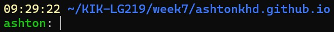

## Introduction

Command-Line Tools for Linguists is a 5 ECTS course that I took at the University of Helsinki. In it we learnt about how to use the command line, focusing on the text processing functions that are particularly useful to linguists.

## Week 1

In week 1 of the course we set up a command-line environment and learnt the basics of how to use it. This included simple commands like `cd` (change your current directory) and `mv` (move or rename a file).

```bash
echo "Hello World" > hello.txt
```

The above command prints "Hello World" into a file called "hello.txt"


## Week 2

In week 2 we learnt more about the structure of a UNIX system. This included learning commands to do things like navigate through the system, moving directories, and compressing directories using `gzip` and `tar`. We also learnt about file permissions, PIDs, background commands, and how to connect to a server.

```bash
chmod a+r
```

The above command gives all users permission to read the file.

## Week 3

In week 3 we learnt the basics of processing text in UNIX. Commands we learnt this week include `file`, `iconv`, `dos2unix`, `tr`, `sort`, `uniq`, `egrep`, and `cut`. We also learnt how to use regex to allow for complex uses of egrep.

```bash
tail -n +1000 file.txt
```

The above command prints file.txt, skipping the first 999 lines.

## Week 4

In week 4 we continued our education on text processing in UNIX. We learnt about piping commands to carry out much more complex operations without needing to create many intermediate files. We also learnt about the sed command and many of its possible uses, and used it to transform a text file into a list of word n-grams.

```bash
cat wordList.txt | tr 'A-Z' 'a-z' | sort | uniq -c | sort -nr
```

The above command orders the words in wordList.txt by frequency. It does this by first converting all words to lower case, then removing any duplicate words and counting how many there are of each one, and then sorting the words in reverse numerical order so the most frequent words are at the top of the list.

## Week 5

In week 5 we learnt how to write scripts and change the values of existing environment variables. We also learnt about the .bashrc file and edited it to personalise our working environment.

This photo shows my new working environment. 

```bash
if [ $# -ne 1 ]
then
  echo "ERROR: One command line argument required."
  echo "$0 input_text_file"
  exit 1
fi
```

The above code (part of one of my scripts) exits the program with an error message if there is more or fewer than one argument when the program is run.

## Week 6

In week 6 we learnt about packages, program libraries, and dependencies. We used this knowledge to install and run new programs (such as python packages). We then learnt about makefiles and how to make and run them.

```bash
sudo apt-get install python3
```

The above command installs python3.

## Week 7

In week 7 we learnt about version control and Git. We installed Git and learnt Git command-line commands. We also each made a Github profile and became familiar with Github repositories, adding files, committing and undoing changes, and creating, switching between, and merging branches. Our final project for this week was to make a GitHub page using Jekyll and markdown.

```
This sentence would have *italics*, **bold**, and `code` in markdown.
```

The above sentence shows a few of the things you can do with markdown.

Other things you can do with markdown include lists:
* This
* is
* a
* list.

and tables:

This | is | a | table 
--- | --- | --- | --- 
Cell 1 | Cell 2 | Cell 3 | Cell 4 
Cell 5 | Cell 6 | Cell 7 | Cell 8 
