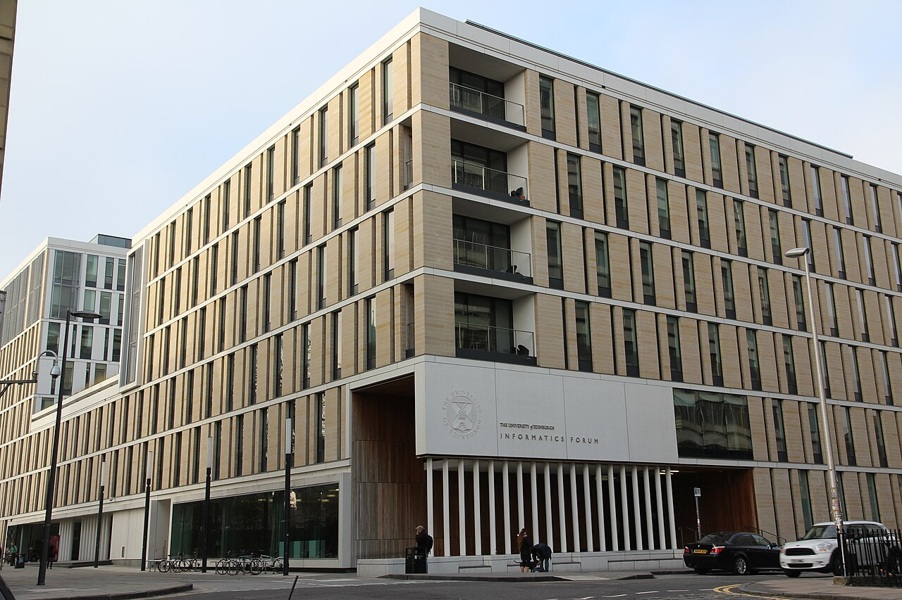

## Introduction
I am a cognitive science student at the University of Edinburgh. I am currently studying at the University of Helsinki as an exchange student for a year. My main interests in cognitive science are computer science, linguistics, and how they interact in the field of natural language processing. 

## Find me on

[GitHub](https://github.com/ashtonkhd)

## Contact

My email address is ashtonhumbydavis@gmail.com. 

## Courses I've Taken

[Suomi 2A](https://studies.helsinki.fi/kurssit/toteutus/hy-opt-cur-2425-142d337f-42c6-415d-8011-3af664024715/SUO-121), Autumn 2024
[Command-Line Tools for Linguists](https://studies.helsinki.fi/kurssit/toteutus/hy-opt-cur-2425-261401a1-c550-4436-91b9-7edf4a1a3b57/KIK-LG221), Autumn 2024
[Grammatical Analysis](https://studies.helsinki.fi/kurssit/toteutus/hy-opt-cur-2425-b593b466-cc30-4f26-8a0b-c19d6751005f/LDA-L328), Autumn 2024
[Speech Prosody](https://studies.helsinki.fi/kurssit/toteutus/hy-opt-cur-2425-373bda4f-70b8-4730-8206-76d0d7efad1b/LDA-P319), Autumn 2024

## Projects

[Command-Line Course final project](https://github.com/ashtonkhd/ashtonkhd.github.io)
